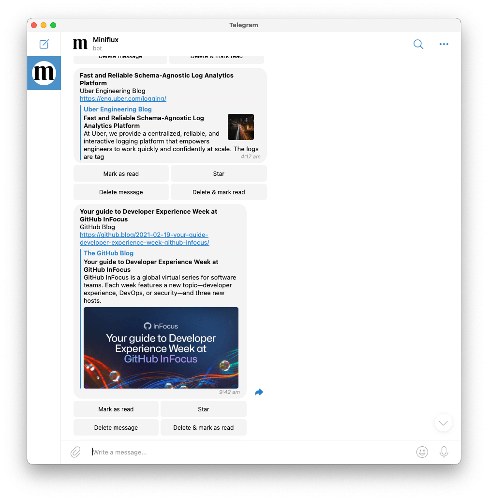

# Miniflux Telegram Bot

A Telegram Bot that sends you new Miniflux entries with inline actions to manage your feed.

## Setup

1. Download the [latest release](https://github.com/jloh/miniflux-telegram-bot/releases/latest/)
1. Place the binary somewhere in your path
1. Set the environment variables outlined below
1. Start the service  
   **Note:** There is a example Systemd `.service` file in the [contrib folder](contrib/)

### Configuration options

| Name                            | Default                       | Description |
| ------------------------------- | ----------------------------- | ----------- |
| `MINIFLUX_URL`                  | `https://reader.miniflux.app` | URL for your Miniflux instance |
| `MINIFLUX_API_KEY` (Required)   | `nil`                         | Your Miniflux API key |
| `MINIFLUX_SLEEP_TIME`           | `30`                          | How many minutes the bot should sleep before checking for new entries |
| `TELEGRAM_BOT_TOKEN` (Required) | `nil`                         | Bot token to use with the Telegram API  |
| `TELEGRAM_CHAT_ID` (Required)   | `0`                           | The Chat ID the bot should send messages to (You can find your Chat ID by talking to [IDBot](https://telegram.me/storebot?start=myidbot)) |
| `TELEGRAM_POLL_TIMEOUT`         | `120`                         | How many seconds to wait for a notification from Telegram before establishing a new connection|
| `TELEGRAM_SECRET` (Required)    | `nil`                         | A secret string used to protect callback queries |
| `TELEGRAM_SILENT_NOTIFICATION`  | `true`                        | Determines whether notifications are delivered [silently](https://telegram.org/blog/channels-2-0#silent-messages) or not |

## License

Code released under the [MIT license](LICENSE).
